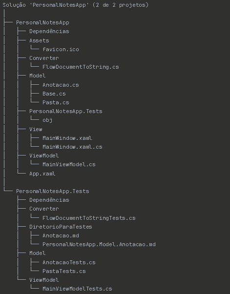

#  Personal Notes App

Um aplicativo Desktop de anotação e gerenciamento de pastas. Desenvolvido com C# e WPF, utilizando arquitetura MVVM.
No PersonalNotesApp o usuário pode adicionar pastas e anotações, salvar e excluir, além de aplicar estilos para a fonte,
como deixar palavras em negrito, itálico e sublinhado. Também é possível alterar o alinhamento do texto.

.png)

.png)

.png)

# ✨ Funcionalidades

* Estrutura Hierárquica: Crie pastas e subpastas ilimitadas
* Editor Rich Text Box: Anotações com formatação usando FlowDocument
* Persistência Automática: Salva automaticamente no sistema de arquivos
* TreeView Interativo: Navegação visual pela estrutura de pastas
* Nomes Únicos: Geração automática de nomes únicos para evitar conflitos
* Exclusão Recursiva: Remove pastas e todo seu conteúdo de forma segura
* Conversão e Reconversão: Anotações salvas como arquivos markdown e reconvertidas para Flow Document
* Estrutura de pastas: Pastas são salvas como diretórios

# 🧪 Cobertura dos testes

* 57.35% de cobertura de linhas
* 47.61% de cobertura de métodos
* 56.81% de cobertura de branches

# Cenários Testados

* ✅ Criação de pastas com nomes únicos automáticos
* ✅ Hierarquia profunda de subpastas
* ✅ Exclusão recursiva de itens
* ✅ Tratamento de exceções (itens nulos, não existentes)
* ✅ PropertyChanged para data binding
* ✅ Mapeamento de estrutura de arquivos
* ✅ Persistência e carregamento de dados

# 🚀 Tecnologias
* WPF
* XAML
* DataBinding
* C#
* MVVM
* xUnity
* FluentAssertions

# 🏗️ Estrutura do projeto

📧 Contato
https://www.linkedin.com/in/lucas-vieira-rocha

